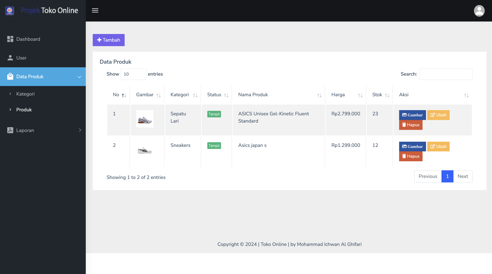

## 📌 Pengenalan

Project ini merupakan project Laravel pada mata kuliah Web Programming III di Universitas Bina Sarana Informatika yang bertemakan tentang Toko Online.

## ✅ Kebutuhan Sistem

Sebelumnya pastikan menginstall terlebih dahulu kebutuhan sistem untuk menggunakan project ini.

-   Git
-   Composer
-   Code Editor _(VS Code, Sublime, dll)_
-   Web Server _(Laragon, XAMPP, dll)_
-   Web Browser _(Chrome, Firefox, dll)_

## ⚙️ Instalasi Project

1. Cloning repository ini melalui terminal. Tunggu hingga selesai cloning.

```
https://github.com/wanziee/toko-online.git
```

2.  Buka project menggunakan Code Editor, lalu inisiasi dependensi composer melalui terminal.

```
composer install
```

3. Duplikat file `.env.example` menjadi `.env` dan konfigurasikan koneksi database menjadi seperti ini pada file `.env`

```
DB_CONNECTION=mysql
DB_HOST=127.0.0.1
DB_PORT=3306
DB_DATABASE=db_tokoonline
DB_USERNAME=root
DB_PASSWORD=
```

4. Tambahkan kredensial Google API di file .env:

```
GOOGLE_CLIENT_ID=your_google_client_id_here
GOOGLE_CLIENT_SECRET=your_google_client_secret_here
GOOGLE_REDIRECT_URL=http://127.0.0.1:8000/auth/google/callback
```

5. Generate key aplikasi pada env melalui terminal.

```
php artisan key:generate
```

6. Generate Storage Link melalui terminal agar dapat mengakses storage.

```
php artisan storage:link
```

7. Migrasikan tabel beserta seeder melalui terminal.

```
php artisan migrate:fresh --seed
```

## 🖼️ Screenshot

<table width="100%">
<tr>
<td><h3 align="center">(admin)Login</h3></td>
<td><h3 align="center">(admin)Home</h3></td>
</tr>
<tr>
<td><h3 align="center">(admin)User</h3></td>
<td><h3 align="center">(admin)Kategori</h3></td>
</tr>
<tr>
<td><h3 align="center">(admin)Produk</h3></td>
<td><h3 align="center">(user)Dashboard/web-pro-3 slide-1</h3></td>
</tr>
<tr>
<td><h3 align="center">(user)Produk Detail/web-pro-3 slide-2</h3></td>
<td><h3 align="center">(user)login using Firebase/web-pro-3 slide-3</h3></td>
</tr>

<!-- <tr>
<td><h3 align="center">Laporan User</h3></td>
<td><h3 align="center">Laporan Produk</h3></td>
</tr> -->
</table>

## 📄 License

Project ini mengacu pada modul praktik dari mata kuliah Web Programming II-III Universitas Bina Sarana Informatika (UBSI). Project ini bersifat open-source untuk edukasi.

<blockquote>Kuliah...? BSI AJA !!</blockquote>
